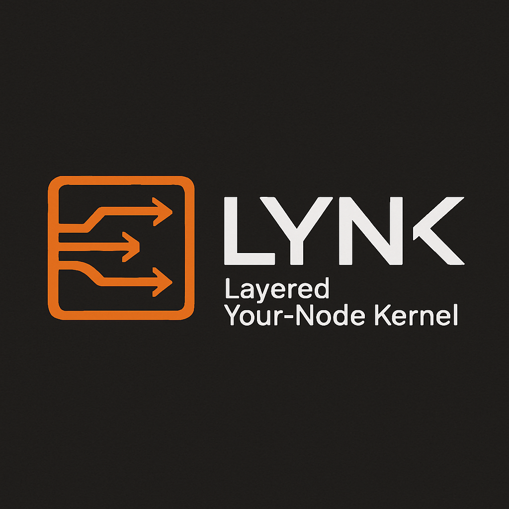

<p align="center">
  
</p>

# 🧠 LYNK – Layered Your-Node Kernel

**LYNK** is a modular and layered communication kernel designed for autonomous systems and multi-drone networks. It provides low-latency, reliable, and scalable communication between nodes using a handler-based infrastructure. LYNK supports multiple communication types such as UART, UDP, and simulated MOCK interfaces, making it suitable for both hardware deployment and testing environments.

---

## 🚀 Key Features

- 📡 **Communication Types:** UART, UDP, MOCK (for testing)
- 🧠 **Protocol Logic:** Start/terminal bytes, versioning, and structured device addressing
- 📦 **Message Types:** Command, Telemetry, ACK/NACK, and Swarm messages
- 🧱 **Modular Design:** Handler-Serializer-Tool architecture for easy extensibility
- 🧪 **Testable:** Fully compatible with `pytest`, supporting mock-based tests

---

## 📁 Project Structure

```plaintext
lynk-root/
├── config.json               # Main protocol and communication settings
├── requirements.txt          # Python dependencies
├── project_tree.txt          # Auto-generated file tree of the repo
├── README.md                 # Project documentation (this file)
├── docs/                     # Technical reports, diagrams, and documents
├── logs/                     # Log files (e.g., system.log)
│
├── src/                      # Main source code
│   ├── core/                 # Core components like frame routing and encoding
│   ├── handlers/             # Message handlers (Command, Telemetry, ACK, etc.)
│   ├── serializers/          # Serialization and deserialization modules
│   ├── swarm/                # Swarm coordination and task assignment
│   └── tools/                # Utility modules (interface, logger, transmitter, etc.)
│
└── tests/                    # Pytest-based modular test structure
    ├── ack/                  # ACK-related tests
    ├── command/              # Command dispatch and handling
    ├── comm/                 # Communication layer tests
    ├── core/                 # Frame routing logic tests
    ├── telemetry/            # Telemetry flow and caching tests
    ├── swarm/                # Swarm command and structure tests
    └── integration/          # Full-system flow and integration tests
```

---

## ⚙️ Installation

```bash
git clone https://github.com/tayfurcnr/LYNK.git
cd lynk-root
pip install -r requirements.txt
```

---

## ⚡ Usage

Update the `config.json` file to select the interface type:

```json
"interface": {
    "comm_type": "MOCK_UART"  // or "UART", "UDP"
}
```

To run a basic system test:

```bash
python -m tests.integration.test_lynk_integration
```

---

## 🧪 Running Tests

Run all tests with:

```bash
pytest tests/
```

Each test submodule is fully independent and can be run standalone. For example:

```bash
pytest tests/ack/test_ack_multithread.py
```

---

## 🧠 Developer Guide

- To **add a new frame type**:
  - Create a serializer in `src/serializers/`
  - Implement a handler in `src/handlers/`
  - Register the handler in `frame_router.py`
- Use `mock_handler.py` in `handlers/comm/` for local testing
- Use `logger.py` to log all frame activity to `logs/system.log`
- Swarm behavior is defined in `swarm_commander.py` and `swarm_manager.py`

---

## 🤝 Contributing

1. Fork the repository
2. Create a new feature branch
3. Add your changes and tests
4. Make sure all tests pass with `pytest`
5. Submit a Pull Request (PR)

We recommend formatting your code with [`black`](https://black.readthedocs.io/) before committing.