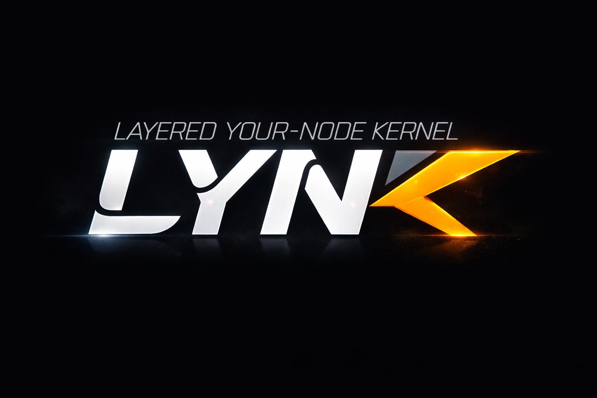

<p align="center">
  
</p>

# 🧠 LYNK – Layered Your-Node Kernel

**LYNK** is a modular and layered communication kernel designed for autonomous systems and multi-drone networks. It provides low-latency, reliable, and scalable communication between nodes using a handler-based infrastructure. LYNK supports multiple communication types such as UART, UDP, and simulated MOCK interfaces, making it suitable for both hardware deployment and testing environments.

---

## 🚀 Key Features

- 📡 **Communication Types:** UART, UDP, MOCK (for testing)
- 🧠 **Protocol Logic:** V2 Frame with 11-byte header, LZ4 compression, and CRC16-CCITT
- 🛡️ **Fleet Management:** Multi-team support with Team ID filtering and "Solo" mode
- ⚡ **Mission Resilience:** Noise recovery, sequence wrap-around, and auto-mesh routing
- 🔐 **Hardened Security:** Anti-tamper, anti-replay, and encrypted payload support
- 🧱 **Modular Design:** Handler-Serializer-Tool architecture for easy extensibility
- 🧪 **Testable:** Fully automated "Test Lab" with visual validation roadmap

---

## 📁 Project Structure

```plaintext
lynk-root/
├── configs/                  # Vehicle and team configurations
│   ├── config.yaml           # Master / Default config
│   ├── node_1/               # Node 1 specific settings
│   └── ...
├── requirements.txt          # Python dependencies
├── README.md                 # Project documentation
├── docs/                     # Technical reports and diagrams
├── logs/                     # Log files (system.log)
│
├── src/                      # 🧠 LYNK Core Kernel
│   ├── core/                 # Frame routing and encoding
│   ├── application/          # ACK, Command, Telemetry modules
│   └── shared/               # Interfaces (UDP/UART), config, and logging
│
├── main.py                   # 🧪 Node Emulator & CLI Test Tool
└── tests/                    # 🏁 Automated Pytest Suite (Modular)
```

---

## ⚙️ Installation

### Core (User)
```bash
pip install -r requirements.txt
```

### Full (Developer & UI)
```bash
pip install -r requirements-dev.txt
```

---

## �️ Fleet Management & Team Logic

LYNK implements a sophisticated filtering and routing system based on **Team IDs** and **Vehicle IDs**.

### Team Categorization:
- 🔵 **Team 1 / 🟢 Team 2**: Standard mission teams.
- ⚪ **Solo Mode (Team 0)**: Independent agents.

### Dynamic Reconfiguration:
Change identity at runtime in `main.py`:
- `I`: Toggle **Vehicle ID**
- `E`: Toggle **Team ID**

---

## 🧪 Testing with Node Emulator
```bash
# Default config
python3 main.py

# Specific config
python3 main.py --config configs/node_1/config.yaml
```

---

## 🎮 LYNK Test Lab
To launch the professional automated test platform and execute sequential system verification:
```bash
python3 test_lab.py
# OR if installed via setup.py
lynk-lab
```
Access at: `http://localhost:8000`

---

## 🏁 Automated Tests
Run all tests with:
```bash
pytest tests/
```

---

## 🧠 Developer Guide

- **Protobuf Generation**: If you change `.proto` files, run:
  ```bash
  python3 setup.py protos
  ```

---

## 🤝 Contributing

1. Fork the repository
2. Create a new feature branch
3. Add your changes and tests
4. Make sure all tests pass with `pytest`
5. Submit a Pull Request (PR)

We recommend formatting your code with [`black`](https://black.readthedocs.io/) before committing.
